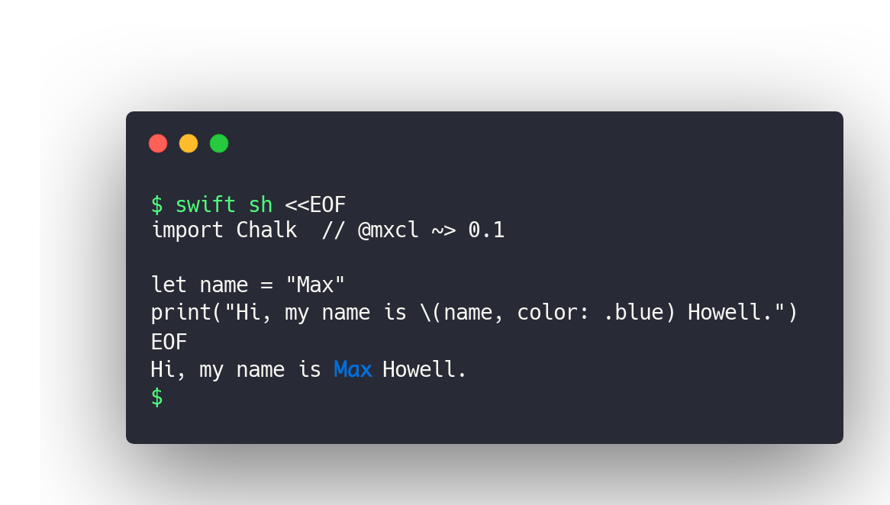

# Chalk

Terminal colors using Swift 5’s string interpolation extensions.

```swift
print("Hi my name is \(name, color: .blue) and I live in Savannah, GA")
print("Hi my name is \(name, color: .blue, style: .bold) and I live in Atlanta, GA")
print("Hi my name is \(name, color: .blue, style: .underline) and I live on Mars")
```



# Name

[Chalk] by [@sindresorhus] is an extremely famous Node package for the same
purpose. Open source is facilitated by naming connections, we picked the same
name to enable those mental connections.

This package is called Chalk, or `mxcl/Chalk` or Chalk for Swift when
disambiguating.

[@sindresorhus]: https://github.com/sindresorhus
[Chalk]: https://github.com/chalk/chalk

# Support mxcl

Hey there, I’m Max Howell, a prolific producer of open source and probably you
already use some of it (I created [`brew`]). I work full-time on open source and
it’s hard; currently *I earn less than minimum wage*. Please help me continue my
work, I appreciate it 🙏🏻

<a href="https://www.patreon.com/mxcl">
	
</a>

[Other ways to say thanks](http://mxcl.github.io/#donate).

[`brew`]: https://brew.sh

# Installation

SwiftPM:

```swift
package.append(.package(url: "https://github.com/mxcl/Chalk.git", from: "0.1.0"))
```

Carthage:

> Waiting on: [@Carthage#1945](https://github.com/Carthage/Carthage/pull/1945).
